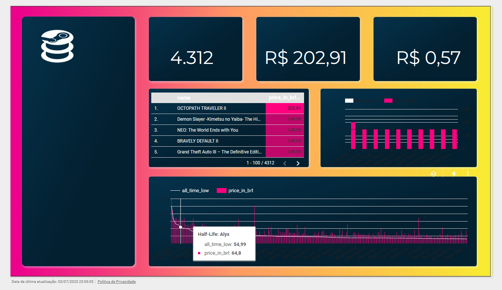
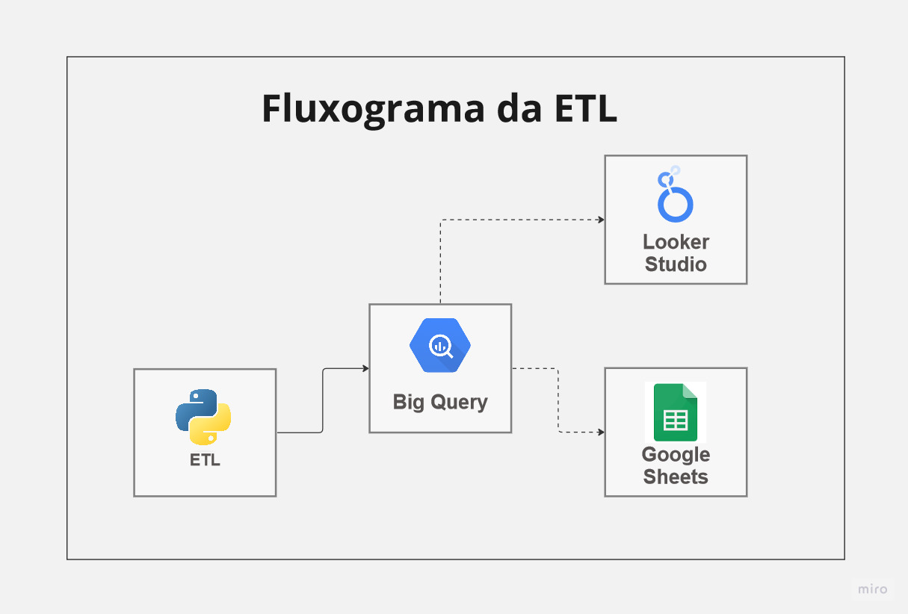
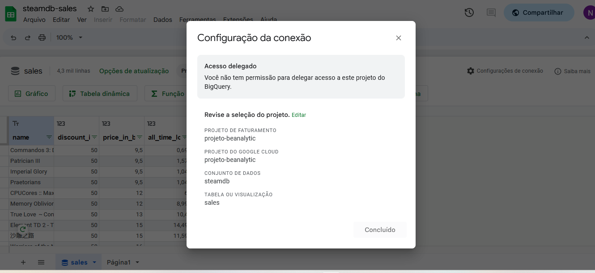
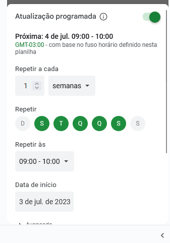

# Webscraping and bigquery

## Visão Geral

* Realize a extração das informações que conseguir da base de dados listada no website: https://steamdb.info/sales/ 

* Armazene estes dados no Google BigQuery

* Em seguida exporte ou conecte esses dados em um Google Sheets e nos envie o link.

### Visualização dos Dados

Para visualização completa do [Dashboard](https://lookerstudio.google.com/s/lfV7_qzYQzc)

### Workflow

## Pre-requisitos

- Python (versão 3.11)
- Bibliotecas Python:
  - requests
  - pandas
  - google-cloud-bigquery
  - bs4

## Etapas 

1. Criação de projeto do Google Cloud Platform (GCP) 
2. Configuração do ambiente, instalando as bibliotecas no python
3. Criação de scripts que irão fazer extração, tratamento e carregamento dos dados
4. Criação do conjunto de dados para o BigQuery
5. Execução do script main.py
6. Query na BigQuery

7. Criação e conexão da planilha no Google sheets com o BigQuery

8. Atualização programada do Google Sheets

9. Criação de script de automação do processo

## Arquivo Google Sheets

Os dados dessa ETL estão no arquivo [Google Sheets](https://docs.google.com/spreadsheets/d/107E1cQSG64BBLDP2_S5-IDIMAwNifvYccLq1XUwSwPM/edit?usp=sharing)

## Contato

Se tiver alguma duvida, sinta-se à vontade para entrar em contato comigo em: 

 
  
   
  

