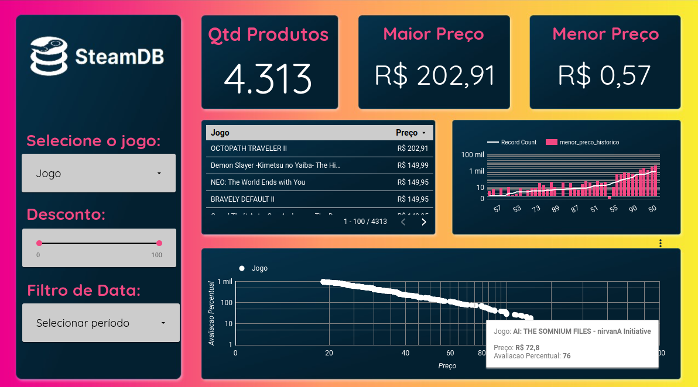

# Webscraping and bigquery

## Visão Geral

Este projeto tem como objetivo realizar a extração de dados de vendas da plataforma Steam, disponíveis no site https://steamdb.info/sales/. O processo de extração, transformação e carregamento (ETL) dos dados será realizado utilizando Python, seguindo uma arquitetura de dados do tipo Medallion.
Os dados extraídos serão armazenados em um Data Lake no Google Cloud Storage e, em seguida, carregados para um Data Warehouse no Google BigQuery. Após o carregamento, os dados serão disponibilizados em uma planilha do Google Sheets para análise e visualização.
A abordagem Medallion foi escolhida por oferecer um modelo de gerenciamento de dados com camadas bem definidas, proporcionando maior rastreabilidade, confiabilidade e flexibilidade na transformação e análise dos dados. As camadas do modelo Medallion são:

Raw: Nesta camada, os dados extraídos diretamente da fonte são armazenados sem modificações, mantendo a integridade dos dados originais.
Processed: Nesta camada, os dados são limpos, transformados e preparados para análise, mantendo um backup das etapas de transformação.
Trusted: Esta é a camada final, onde os dados validados e aprovados ficam disponíveis para uso em análises críticas e tomada de decisão.

Além do armazenamento e transformação dos dados, este projeto também inclui a criação de um dashboard interativo no Google Data Studio, permitindo a visualização e análise dos dados de vendas da plataforma Steam.

### Visualização dos Dados

Para visualização completa do [Dashboard](https://lookerstudio.google.com/reporting/48ffd759-acd5-45ce-be7c-94536869e41f)

### Workflow

## Pre-requisitos

- Python (versão 3.12)
- Bibliotecas Python:
  - requests
  - pandas
  - google-cloud-bigquery
  - bs4

## Etapas 

1. Configuração do ambiente de desenvolvimento:
* Criação de um ambiente virtual (venv)
* Instalação das bibliotecas necessárias através do arquivo requirements.txt
* Configuração das variáveis de ambiente no arquivo .env
2. Extração de dados:
* Acesso ao site https://steamdb.info/sales/
* Utilização da biblioteca BeautifulSoup para fazer o webscraping dos dados
* Limpeza e transformação dos dados extraídos
3. Carregamento de dados:
* Criação do projeto, dataset e tabela no Google BigQuery
* Carregamento de dados brutos e tratados para o datalake
* Carregamento dos dados tratados para o BigQuery
* Exportação dos dados para uma planilha no [Google Sheets](https://docs.google.com/spreadsheets/d/1siFjaCa92INpVe-cp2kr8vIAiNvs5thCLkI4VxBTjC8/edit?usp=sharing)
4. Análise e visualização:
* Criação de consultas SQL no BigQuery para análise dos dados
* Desenvolvimento de um dashboard no Google Data Studio para visualização dos insights
5. Automatização do processo:
* Criação de um script de automação bash para executar o processo de ETL periodicamente

## Contato

Se tiver alguma duvida, sinta-se à vontade para entrar em contato comigo em: 

 
  
   
  

